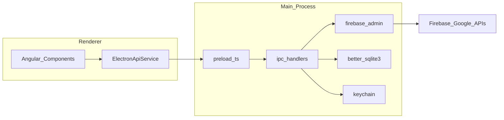

# FireKit — Architecture

## Overview

FireKit is an **Electron** application:

- **Renderer** — Angular 21+ SPA with Spartan UI (`src/`)
- **Main** — Node.js process with `firebase-admin`, SQLite index, keychain (`electron/`)
- **Bridge** — Preload script exposes `window.firekit`; IPC uses typed channels in `shared/ipc.ts`



## Repository layout

```
FireKit/
├── shared/ipc.ts           # Channels + DTO types
├── electron/
│   ├── main.ts
│   ├── preload.ts
│   ├── ipc/                # ipcMain.handle registrations
│   ├── firebase/admin.ts   # Per-project admin.app()
│   ├── index/sqlite.ts     # doc_index table
│   └── secrets/keychain.ts
├── src/app/                # Angular features
└── libs/ui/                # Spartan helm components (add via `ng g @spartan-ng/cli:ui`)
```

## IPC contract

All channels use `ipcMain.handle` / `invoke`. Payloads are JSON-serializable DTOs defined in `shared/ipc.ts`.

| Domain | Channels |
|--------|----------|
| Projects | `projects:list`, `projects:add`, `projects:remove`, `projects:setActive`, `projects:getActive` |
| Connection | `projects:testConnection` |
| Firestore | `firestore:listCollections`, `firestore:listDocuments`, `firestore:query`, `firestore:get`, `firestore:upsert`, `firestore:delete` |
| Index | `index:syncStart`, `index:syncStatus`, `index:search`, `index:clear`, `index:onProgress` (event) |
| Auth | `auth:listUsers`, `auth:getUser`, `auth:getUserByEmail`, `auth:createUser`, `auth:deleteUser`, `auth:setDisabled` |

Handlers receive `projectId`. Main loads credentials from keychain and caches `admin.app(projectId)`.

## firebase-admin lifecycle

1. On `projects:add`, parse service account JSON, store secret in keychain, persist metadata in `userData/projects.json`
2. On first use of `projectId`, `admin.initializeApp({ credential }, projectId)` (named app)
3. `getFirestore(app)` / `getAuth(app)` for operations
4. On `projects:remove`, `deleteApp` and delete keychain entry

## SQLite search index

Database file: `{userData}/firekit-index.db`

```sql
CREATE TABLE doc_index (
  project_id TEXT NOT NULL,
  collection_path TEXT NOT NULL,
  doc_id TEXT NOT NULL,
  updated_at INTEGER,
  body_json TEXT NOT NULL,
  search_text TEXT NOT NULL,
  PRIMARY KEY (project_id, collection_path, doc_id)
);
CREATE INDEX idx_search ON doc_index(project_id, collection_path);
```

**Sync:** Paginated Firestore reads (`orderBy` + `startAfter`) upsert rows. Incremental sync uses stored high-water `updated_at` when collection has a consistent timestamp field (default `updateTime` metadata mapped in sync job).

**Search:** `WHERE project_id = ? AND collection_path = ? AND search_text LIKE ?` with LIMIT/OFFSET; debounced from UI (300ms).

## Performance

- Default page size **50**; never fetch unbounded snapshots for table views
- Virtualized tables in Angular for long pages
- IPC returns slim objects: `{ id, path, data, updateTime }` not full SDK classes
- Index sync runs async in main; progress via `webContents.send`

## Development vs production

| Mode | Renderer URL |
|------|----------------|
| Dev | `http://localhost:4200` (ng serve) |
| Prod | `file://…/dist/firekit/browser/index.html` |

Production Angular build uses `baseHref: "./"` and hash routing (`withHashLocation`) so assets and routes work under `file://` in Electron.

Main/preload compiled to `dist-electron/` via `tsc -p electron/tsconfig.json`.

## Security defaults

```ts
webPreferences: {
  contextIsolation: true,
  nodeIntegration: false,
  sandbox: true,
  preload: '…/preload.js',
}
```

ESLint should forbid `firebase-admin` imports under `src/`.
